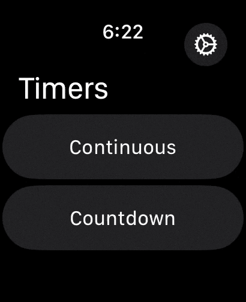
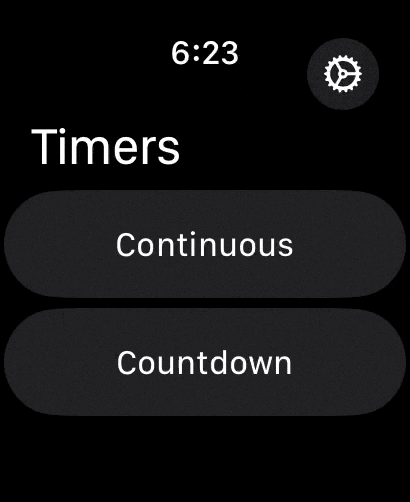
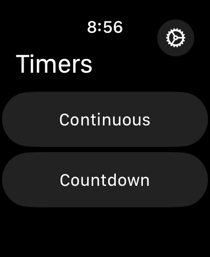
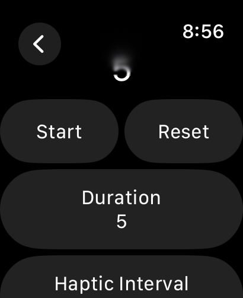
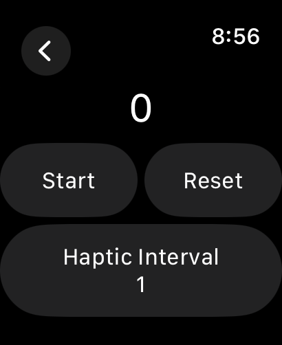
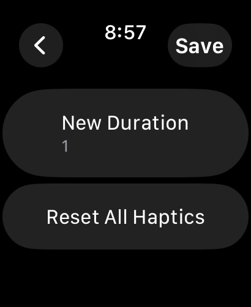

# Watch Haptics

<section align="center">
  
  &nbsp;&nbsp;&nbsp;&nbsp;&nbsp;
  
  &nbsp;&nbsp;&nbsp;&nbsp;&nbsp;

</section>

### Overview:

An independent **WatchOS** app that schedules customisable repeating haptic notifications.

### Use Case:

Regular and repeating haptic notifications are a useful and versatile tool with a range of applications. Distinct from typical **NotificationCenter** notifications, this **WatchOS** haptic app provides users with the ability to adapt notification frequency and intensity tailored to unique situations and individual needs. 

A simple and intuitive interface allows for the swift deployment of either pre-configured interval-based notifications or continuous, uninterrupted notifications, ensuring flexibility in haptic delivery suitable for any situation. 

Utilising this application empowers users to remain informed and connected throughout their day, enriching their overall experience with Apple's wearable technology.

        
Contents:

        <ul class="overview-section">
        <li><h3><a href="#future-plans">Future Plans</a></h3></li>
        <li><h3><a href="#current-difficulties">Current Difficulties</a></h3></li>
        <li><h3><a href="#past-problems">Past Problems</a></h3></li>
        <li><h3><a href="#screenshots">Screenshots</a></h3></li>
        <li><h3><a href="#licensing">Licensing</a></h3></li>
    </ul>
    

&nbsp;

# Project Progression

## Future Plans:

#### - <ins>Haptic Type Customisation</ins>

#### - <ins>Variable Haptic Intensity</ins>

## Current Difficulties:

#### - <ins>Issues with local deployment</ins>

Having problems deploying the application directly to a device for testing. This is likely a local issue with device certificates registered within Xcode or under the Apple Developer account, although it has been okay with other projects so will need to debug to know for sure. Beta versions have been tested on a physical device.

## Past Problems:

#### - <ins>Maintaining reusable code across notification types</ins>

There was some initial difficulty ensuring that timer logic and UI elements could be reused across continuous and time-limited notifications. This was because beta code was improved upon and made generic within a single context, after adding additional contexts logic was further developed to easily accommodate any future developments. A good example of code reusability is the **IntervalPickerView** which was written generically to enable its use points throughout the project.

#### - <ins>Customisable Interval Presets</ins>

# Screenshots

&nbsp;&nbsp;&nbsp;&nbsp;&nbsp;

&nbsp;&nbsp;&nbsp;&nbsp;&nbsp;
  
  &nbsp;&nbsp;&nbsp;&nbsp;&nbsp;
  

 

### Licensing

There is [no license](https://choosealicense.com/no-permission/) associated with this project other than usual GitHub [Terms of Service](https://docs.github.com/en/site-policy/github-terms/github-terms-of-service), however, please be mindful and acknowledge me as the original author if you use significant or distinct portions of this code.
